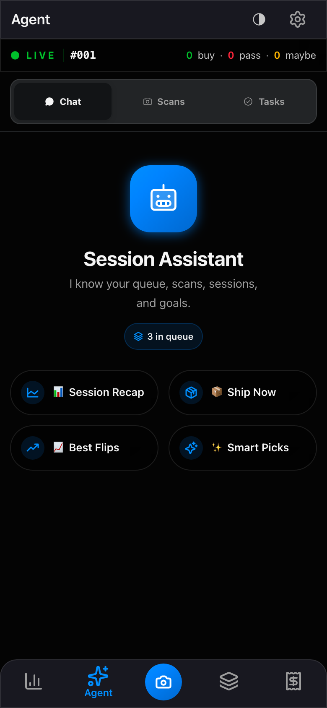
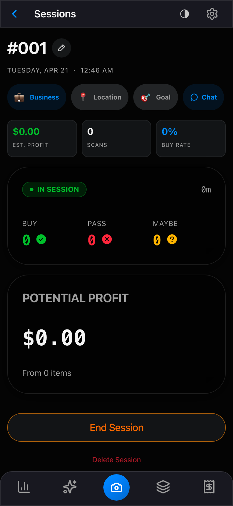
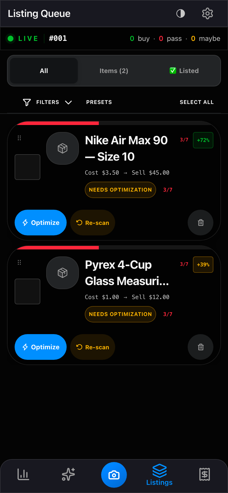
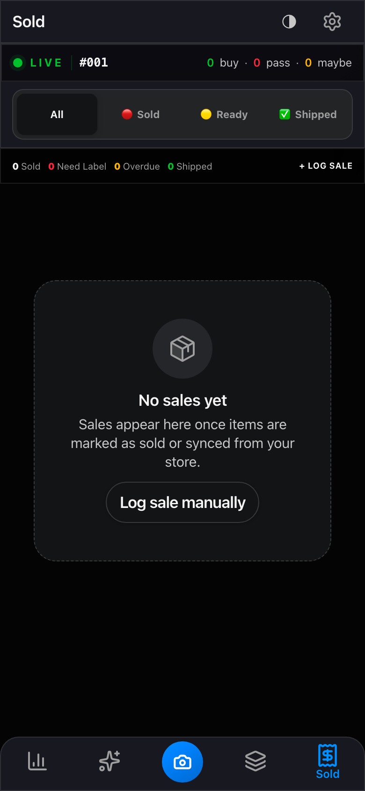

<p align="center">
  
</p>

<h1 align="center">Resale Scanner Pro</h1>

<p align="center">
  <strong>One scan. Identify, price, decide, list, ship — from the field.</strong>
</p>

<p align="center">
  <a href="https://resale-scanner-pro-production.up.railway.app">🔗 Live app</a> ·
  <a href="./AGENTS.md">Engineering protocol</a> ·
  <a href="./CLAUDE.md">Agent workflow</a> ·
  <a href="./PRD.md">Product record</a>
</p>

---

## Why this exists

The most expensive time in a reselling business is the gap between finding an item in the field and turning it into a priced, listed, profit-modeled SKU. Today that gap is spread across five apps — camera, comps lookup, spreadsheet, listing tool, shipping portal — and every handoff loses information.

Resale Scanner Pro collapses the stack into a single mobile surface. One scan produces an identification, a market read, a BUY/PASS call, a ready-to-publish listing, and a back-office record. AI runs the judgment-heavy steps. Structured pipelines run the operational ones. A production database holds everything that needs to survive the session.

---

## Status — 2026-04-21

**Shipped**

- Live production app on Railway, auto-deploy on merge to `main`
- eBay Developer Program approved · production OAuth · live Sell API listings
- RSP Phase 3 — end-to-end scan → list → push pipeline (2026-04-16)
- iPhone Polish Program — 12-PR Apple-native UI/UX pass (2026-04-20)
- PWA home-screen install — dark-gradient edge-to-edge iOS icon (2026-04-21)
- WF-09 Sale Alert automation — n8n → Notion back office

**In flight**

- Multi-marketplace publishing (Mercari · Poshmark · Depop)
- In-app shipping label purchase (Pirate Ship · Shippo)

---

## Built with agents

This repo is the first production product shipped out of **Loft OS** — a home-grown agentic development system.

| Agent | Role |
| --- | --- |
| **CA** — Claude (strategy) | Architecture, planning, Notion orchestration, governance writes |
| **CE-VS** — Copilot in VS Code | Repo changes, infra, Railway, Supabase migrations |
| **SA-VS** — Claude Code | Autonomous build sessions, parallel work orders, deep codebase changes |
| **Owner** | Plan approval, PR approval, merge approval, ED walkthroughs |

The humans run the gates; the agents run the loops. Every agent output — code change, Notion write, deploy log — links back to a numbered Work Order (`WO-RSP-###`) or Active Workstream (`WS-##`), so the full development history is queryable. This README was refreshed through the same pipeline.

---

## The pipeline

```text
STORE ─► 📸 scan ─► 🧠 Gemini Vision ID ──► 📊 market research ──► 💰 profit math
                                                                          │
                                                          ┌──────── BUY / MAYBE / PASS
                                                          │
                                                          ▼
                                            📦 Photo Manager (Supabase Storage)
                                                          │
                                                          ▼
                                              📝 Listing Queue (7-section editor)
                                                          │
                                                          ▼
                                 🤖 AI enrichment: title · description · condition
                                    · category · item specifics · pricing
                                                          │
                                                          ▼
                                    ✅ 9 required checks + 5 warnings gate
                                                          │
                                                          ▼
                                     🛒 Confirm & Push → eBay Sell API (live)
                                                          │
                                                          ▼
                                   🗃️ Notion back-office record written on confirm
                                                          │
                                                          ▼
                                       📮 Pack → ship → sale alert → close loop
```

> **Two containers, one rule.** The *Scan / Research* pile holds `PENDING` + `MAYBE` items — everything reversible, `PASS` kept with Restore, re-scan available until push. The *Listing Queue* holds `BUY` items only — optimize, gate, push. No mixing. **Notion is the back office** — it receives the confirmed record *after* eBay confirms, carrying the real Item Number, Listing URL, ROI, Gross Profit, Break Even, Net Payout, and 24 KPIs. The app runs the workflow. Notion runs the business.

---

## Live product views

<p align="center">
  
</p>

The **Agent workspace** is the product's natural-language command surface. It knows the live session, the queue, every scan, and the sold pile — and exposes one-tap actions (*Session Recap*, *Ship Now*, *Best Flips*, *Smart Picks*) on top of a full chat layer. Point it at the day and it answers: *what should I list next, what's overdue to ship, which item flips hardest, which scans am I sleeping on.*

| Live session | Listing Queue | Shipping Center |
| --- | --- | --- |
|  |  |  |

Full Apple-native UI pass complete — large-title collapse, liquid-glass tab bars, material-thin surfaces, semantic design tokens, haptics, safe-area respect, optical typography scale. Three ED walkthroughs passed during the polish program.

---

## Product surfaces

| Screen | What it does |
| --- | --- |
| **Session** | Sourcing run management — goals, spend, active pile, session performance |
| **Scanner / AI Analysis** | Camera capture → Gemini Vision ID → comps → BUY/PASS signal |
| **Agent** | Natural-language command surface across scans, listings, sold items, research |
| **Listing Queue** | BUY pile — optimize listing, run the gate, push to eBay |
| **Sold / Shipping Center** | Post-sale tracking, label purchase, Pirate Ship rate card, Notion sync |
| **Cost Tracking** | AI cost model per scan · per listing · per session · per month |
| **Settings** | API keys, business rules, Notion DB bindings, agent behavior |

---

## Stack

| Layer | Technology |
| --- | --- |
| Frontend | React 18 + TypeScript + Vite + Tailwind + Radix primitives |
| Mobile | PWA with iOS home-screen install, standalone display, dark splash |
| Backend | Node + Express (`server.js`) on Railway |
| Database | Supabase Postgres (`zfbaijiynnwxasyyqglg`) — `scans`, `ebay_tokens`, `listing-photos` bucket |
| Auth / RLS | Supabase service-role + anon policies, singleton token row pattern |
| AI — Vision & Research | Google Gemini 2.0 Flash |
| AI — Copy & Listing Optimization | Anthropic Claude API |
| Marketplace | eBay Sell API (production OAuth, Fulfillment / Return / Payment policies) |
| Automation | n8n workflows (WF-08 Deploy log, WF-09 Sale Alert) |
| Governance | Notion databases (Checksum Registry, Governed Work Mirror, Active Workstreams) |
| CI / Deploy | GitHub Actions → Railway (`deploy/production`) |

---

## Architecture — Core vs Shell

The app is split into two layers with very different stability contracts, and that split is what lets AI design tools rebuild the UI without ever touching the pipeline.

The **Core** is stable: the Express backend (`server.js`), the service layer (`src/lib/*.ts`), the type contracts (`src/types/index.ts`), and the wiring script (`scripts/apply-wiring.mjs`). It is guarded by fatal backend integrity checks plus the `tsc` and `lint` gates in CI.

The **Shell** is interchangeable: `src/App.tsx`, the screen components, and the UI primitives. A design tool can redesign any of it. When a new shell lands, `apply-wiring.mjs` re-injects service wiring, the `tsc` + `lint` gates surface broken prop contracts, and the remaining anchor-miss warnings become the manual reconnection punch list. The backend, data model, and business logic never move.

---

## Engineering protocol

Every change — human, Claude, or Codex — follows the same six phases: **Plan → Execute → PR Gate → PR → Review → Merge Gate**. The Owner approves the plan, the PR, and the merge. Deploy gates run in order on every PR: `apply-wiring.mjs`, then `tsc --noEmit`, then `lint`. Railway redeploys on merge; the event writes to Notion via WF-08. Every merge writes a **Checksum Registry** entry (`{CHECKSUM:RSP/YYYY-MM-DD/PRxxx-slug}`) — historical versions are never overwritten, they transition to `⚪ Superseded`. Full protocol in [`AGENTS.md`](./AGENTS.md).

---

## Run locally

```bash
git clone https://github.com/avergara13/resale-scanner-pro.git
cd resale-scanner-pro
npm install
npm run dev
```

The app runs on `http://localhost:5173`. For Gemini Vision locally, see [`GOOGLE_CLOUD_SETUP.md`](./GOOGLE_CLOUD_SETUP.md). All production secrets live in Railway environment variables — never commit `.env*` files.

---

## Repository docs

| Doc | Purpose |
| --- | --- |
| [`AGENTS.md`](./AGENTS.md) | Canonical engineering protocol, PR standards, deploy gates |
| [`CLAUDE.md`](./CLAUDE.md) | Claude-specific operating instructions, branch strategy, governance rules |
| [`CONTEXT.md`](./CONTEXT.md) | Project context, handoff notes, Notion pointers |
| [`PRD.md`](./PRD.md) | Product requirements and decision log |
| [`CONTRIBUTING.md`](./CONTRIBUTING.md) | Repo standards, PR format, commit conventions |
| [`GOOGLE_CLOUD_SETUP.md`](./GOOGLE_CLOUD_SETUP.md) | Local Gemini / Google API setup |

---

## What's next

- **Multi-marketplace publishing** — extend the listing pipeline beyond eBay (Mercari, Poshmark, Depop)
- **In-app shipping label purchase** — Pirate Ship + Shippo rate cards wired into the Sold screen
- **Autonomous sourcing agents** — extend SA-VS beyond dev into live sourcing triage

---

## License

Proprietary — source available for portfolio review. Not licensed for redistribution or commercial use. See [`LICENSE`](./LICENSE).

---

<p align="center">
  <sub>Resale Scanner Pro · first product out of Loft OS · built by Angel Vergara<br/>
  <em>Hobbyst Resale · Vergara Inc</em></sub>
</p>
